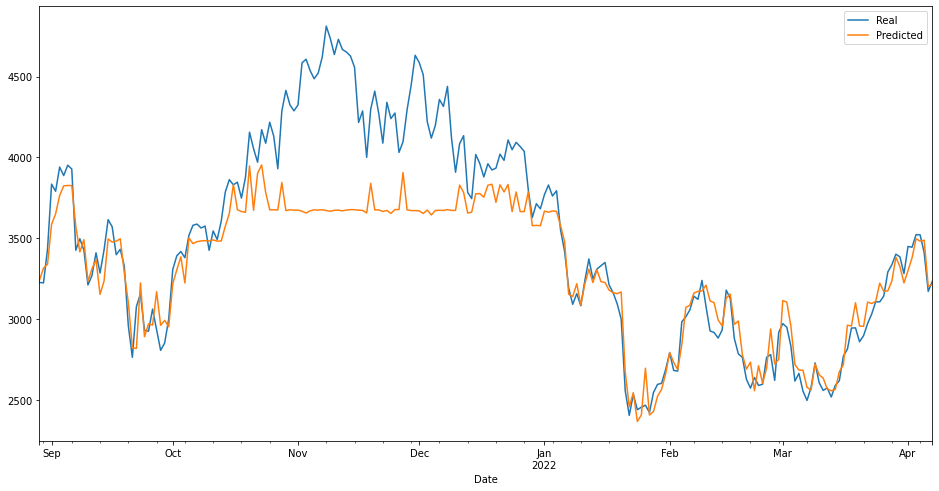

# Project 2
## Machine Learning in Cryptocurrency Analysis

For project two, we wanted to see if we could predict future closing prices for Ethereum. We selected following algorithms to determine which  has the best accuracy for outputting the best prediction. 
- Linear Regression
- Random Forest
- Gradient Boosting
- XGBoost
- LSTM (Long Short Term Memory)
- GRU(Gated Recurrent Units) 

We also used Hyper Parameter Tuning to come up with best parameter for our model training. Amoung the available hyper parameter tuning methods available we implemented RandomSearch and hyperband. 

## Methodology

The first thing we looked into was finding our data. We got our data from yfinance sdk. We took 2 years of data with daily grain. 

After collecting the data, the data was graphed. We needed to graph the data so we can see how the real performance of ETH-USD is.

From here, we massaged the data to make it appropriate for predictions. We shifted the data  downward using '-1' in each column of the dataframe so that we could use past data to predict future data. We split the data 70:30 and also scaled all the feature data appropriately. 

Next thing to do was setup the hyperparameter tuning mechanism. We wanted to try out different mechanism for hyper parameter tuning 
Some of the alorigthms we used randomsearch ; but for others we used hyperband. Also, we used different libraries for neural networks. 

Next we set up the model, fit the training data. 

Then we make the predictions. This is done by 'model.predict(X_test)', then print and plot the predicted results.

We then evaluate the model to assess its performance. This is done by using 'model.evaluate'. This will show us the test loss and test accuracy. 

Close to last, to be able to test the accuracy, we  import metrics from sklearn to print and test accuracy percentages.

From here the predictions are complete. 

## Results

GRU

LSTM

Random Forrest

XGBoost

Linear Regresson

## Conclusion
We concluded that we can somewhat use the different algorithm to predict the future value of eth-usd. However, we realized that the prediction is good only for one day of data. 

We realized that more data necessarily does not mean better models. We also found that newer, complicated models is not necessarily better all the time. It depends upon the use case. For our use case Linear Regression performed the best. 

If we had more time, we would have looked into integrating more features such as inflation data, other crpto data. We would also use other models especially Arima which is known to have better prediction for farther out data. 

We also would have integrated some sentiment analysis using news site and twitter data. 

